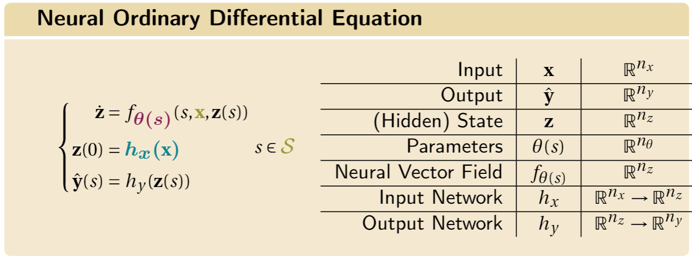

<p align="center"> 

</p>

<div align="center">

[](https://papers.nips.cc/paper/2020/hash/293835c2cc75b585649498ee74b395f5-Abstract.html)
[](https://papers.nips.cc/paper/2020/hash/293835c2cc75b585649498ee74b395f5-Abstract.html)
[](https://arxiv.org/abs/2002.08071)
[](https://papers.nips.cc/paper/2020/hash/293835c2cc75b585649498ee74b395f5-Abstract.html)

</div>

This code for the paper "Dissecting Neural ODEs" to appear as an oral presentation in the Thirty-fourth Conference on Neural Information Processing Systems (NeurIPS 2020).

> Continuous deep learning architectures have recently re-emerged as Neural Ordinary Differential Equations (Neural ODEs). This infinite-depth approach theoretically bridges the gap between deep learning and dynamical systems, offering a novel perspective. However, deciphering the inner working of these models is still an open challenge, as most applications apply them as generic black-box modules. In this work we ``open the box'', further developing the continuous--depth formulation with the aim of clarifying the influence of several design choices on the underlying dynamics.

paper: [arXiv link](https://arxiv.org/abs/2002.08071)

This repository contains supplementary code for the experiments described in the main text. These notebooks are designed to be self-contained.
The implementation is built on [PyTorch](https://pytorch.org/) and [PyTorch-Lightning](https://www.pytorchlightning.ai/) and relies on [torchdyn](https://github.com/DiffEqML/torchdyn) and [torchdiffeq](https://github.com/rtqichen/torchdiffeq).

<p align="center"> 

</p>

This is a research project and not an official `DiffEqML` product. Expect bugs and sharp edges. Please help by trying it out, reporting bugs, and providing feedback!

If you find our work useful, consider citing us:

```
@article{massaroli2020dissecting,
  title={Dissecting neural odes},
  author={Massaroli, Stefano and Poli, Michael and Park, Jinkyoo and Yamashita, Atsushi and Asama, Hajime},
  eprint={2002.08071},
  archivePrefix={arXiv},
  primaryClass={cs.LG}
  year={2020}
}
```
