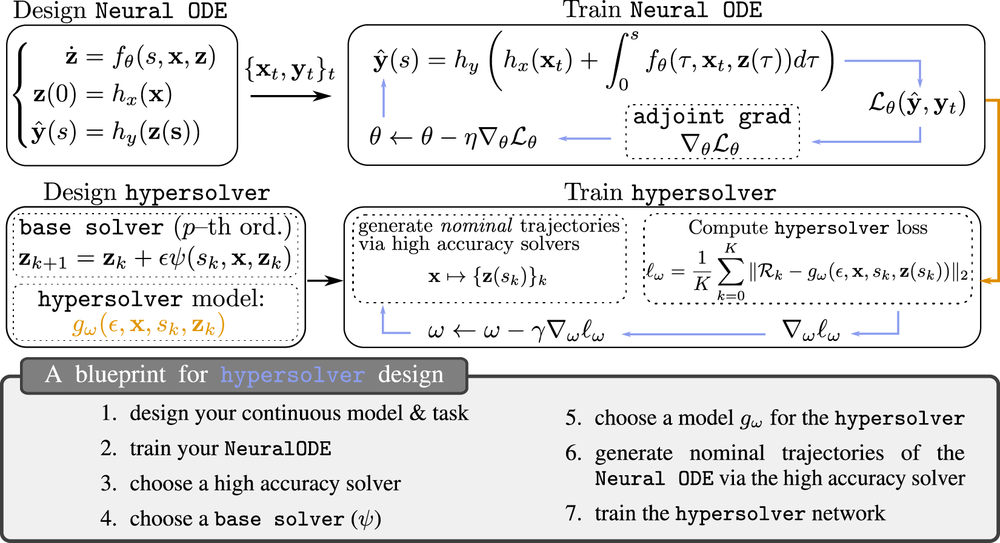

This code for the paper "Hypersolvers: Toward Fast Continuous-Depth Models" to appear in the Thirty-fourth Conference on Neural Information Processing Systems (NeurIPS 2020).

```The infinite--depth paradigm pioneered by Neural ODEs has launched a renaissance in the search for novel dynamical system-inspired deep learning primitives; however, their utilization in problems of non-trivial size has often proved impossible due to poor computational scalability. This work paves the way for scalable Neural ODEs with time-to-prediction comparable to traditional discrete networks. We introduce hypersolvers, neural networks designed to solve ODEs with low overhead and theoretical guarantees on accuracy. The synergistic combination of hypersolvers and Neural ODEs allows for cheap inference and unlocks a new frontier for practical application of continuous--depth models. Experimental evaluations on standard benchmarks, such as sampling for continuous normalizing flows, reveal consistent pareto efficiency over classical numerical methods.```

paper: [arXiv link](https://arxiv.org/abs/2007.09601)

<p align="center"> 


</p>

This repository contains supplementary code for the experiments described in the main text, namely regarding applications of Hypersolvers to tasks: `image_classification` and `density_estimation.`. These notebooks are designed to be self-contained.

Hypersolvers rely on [torchdyn](https://github.com/DiffEqML/torchdyn) and [torchdiffeq](https://github.com/rtqichen/torchdiffeq).

If you find our work useful, consider citing us:

```
@misc{poli2020hypersolvers,
      title={Hypersolvers: Toward Fast Continuous-Depth Models}, 
      author={Michael Poli and Stefano Massaroli and Atsushi Yamashita and Hajime Asama and Jinkyoo Park},
      year={2020},
      eprint={2007.09601},
      archivePrefix={arXiv},
      primaryClass={cs.LG}
}
```
